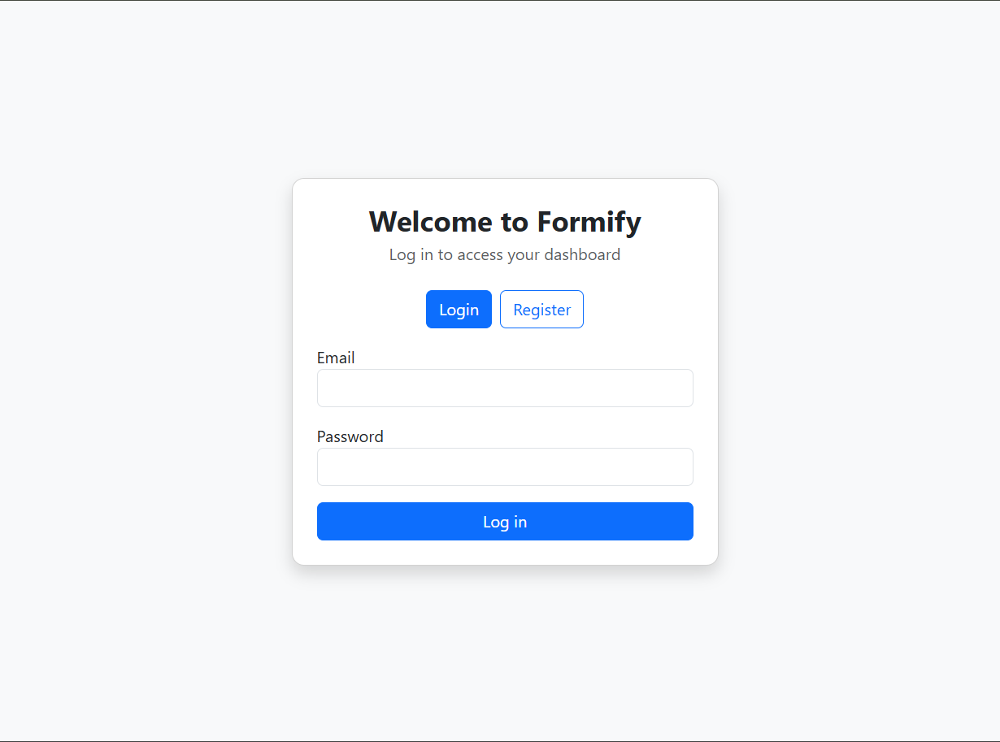
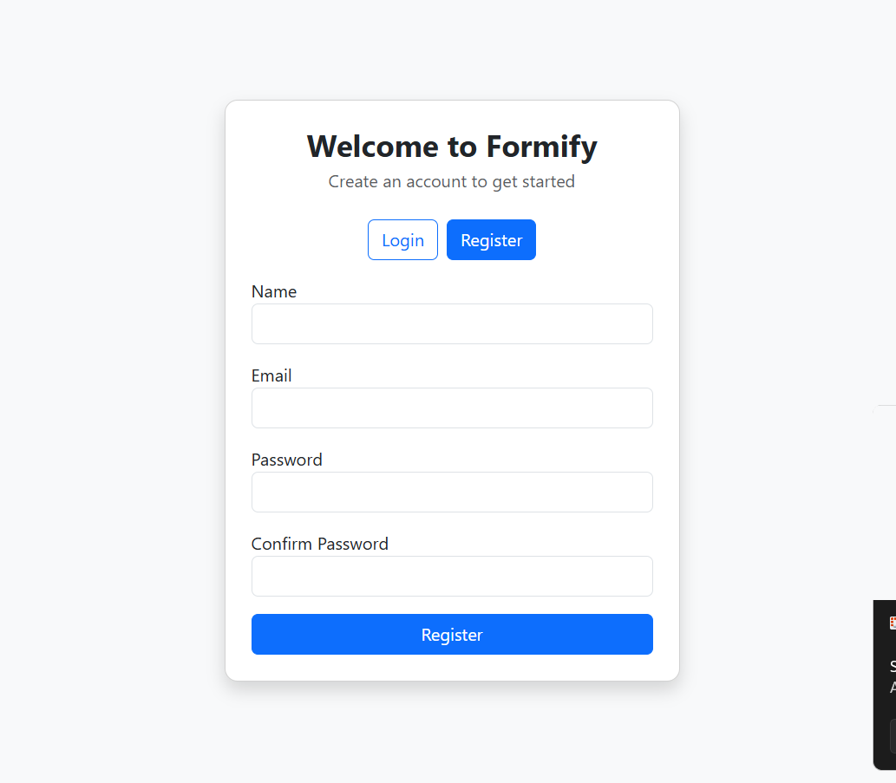
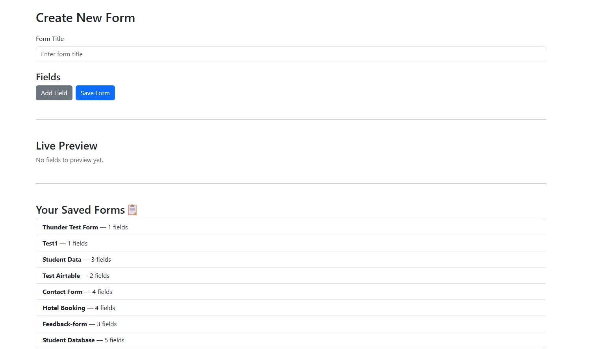
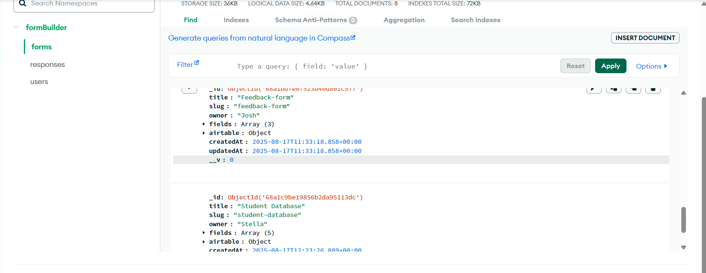
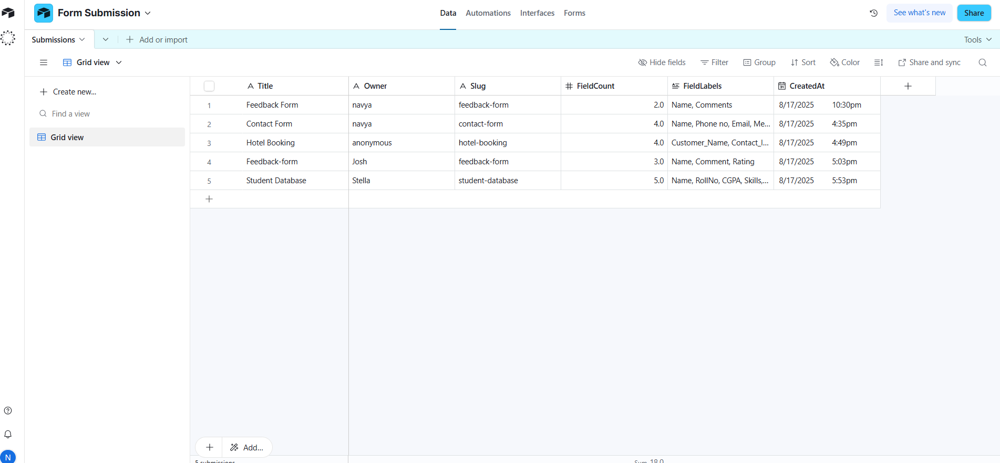

⚡️ Recruiter-ready MERN app with dynamic form logic and Airtable sync

# 🧠 Dynamic Airtable-Connected Form Builder

A full-stack application built with MongoDB, Express, React, and Node.js that allows users to create dynamic forms with conditional logic, preview them in real-time, and sync submissions directly to Airtable. Designed for interview impact, this app showcases clean UI, robust backend integration, and real-world data workflows

---

## 🚀 Live Demo

- **Frontend:** [https://dynamic-form-frontend-phi.vercel.app](https://dynamic-form-frontend-phi.vercel.app)
- **Backend:** [https://dynamic-form-backend-gumc.onrender.com](https://dynamic-form-backend-gumc.onrender.com)

---

## 🛠 Tech Stack

- **Frontend:** React, Vite, Bootstrap
- **Backend:** Node.js, Express, MongoDB Atlas
- **Third-Party Integration:** Airtable API
- **Deployment:** Vercel (frontend), Render (backend)

Additional tools:

- Thunder Client (API testing)
- Render (deployment)
- GitHub (version control)

---

## 📦 Features

### ✅ Core Functionality

- User login with dynamic owner tracking
- Form builder with Airtable field selection
- Conditional logic between questions
- Form viewer with dynamic field rendering
- Form submission synced to Airtable
- MongoDB stores user and form metadata

### 🎁 Bonus Features

- Form preview before submission
- Dashboard for saved forms
- Graceful fallback if Airtable user object is missing
- Clean, recruiter-ready UI

---

## 🔐 Airtable Integration

> ⚠️ **Note on OAuth:**  
> For simplicity and faster demo setup, Airtable OAuth was skipped.  
> Instead, the app uses a direct Airtable API key and base/table config via `.env`.  
> The architecture is modular and can be extended to support OAuth if needed.

- Airtable fields are fetched dynamically
- Only supported field types are used:
  - Short text
  - Long text
  - Single select
  - Multi select
  - Attachment (File Upload)
- Form responses are saved as new records in Airtable

---

## 🧪 Conditional Logic

Each question can be shown or hidden based on previous answers.

**Example:**

> Show “GitHub URL” only if `Role = Engineer`

This logic is applied both in the form builder and dynamically during form filling.

---

## 📁 Folder Structure

```text
dynamic-form-builder/
├── backend/
│   ├── controllers/
│   ├── models/
│   ├── routes/
│   ├── utils/
│   ├── .env.example
│   ├── server.js
│   └── package.json
│
├── frontend/
│   ├── components/
│   ├── pages/
│   ├── services/
│   ├── assets/
│   ├── App.jsx
│   ├── main.jsx
│   └── package.json
│
├── .env.example
├── README.md
```

---

## ⚙️ Setup Instructions

### 1. Clone the Repo

```bash
git clone https://github.com/navyaarora30/dynamic-form-builder.git
cd dynamic-form-builder


2. Create .env File
Copy the example file and fill in your credentials:
cp .env.example .env


3. Install Dependencies
Backend
cd backend
npm install
npm start


Frontend
cd ../frontend
npm install
npm run dev


📸 Screenshots
### 🔐 Login Screen
[](./screenshots/login-page.png)
Users log in to access personalized form builder dashboard.

### 📝 Registration Screen
[](./screenshots/register-page.png)
New users can register with name, email, and password. Includes validation and clean UI.

### 🧠 Form Builder UI
[](./screenshots/form-builder-ui.png)
Users create custom forms with dynamic fields. Saved forms are listed for reuse and Airtable sync.

### 🧩 Field Creation
[](./screenshots/field-creation.png)
Each field supports label, type selection, and validation like “Required.” Live preview updates instantly.

### 🗄️ MongoDB Sync
[](./screenshots/mongodb-sync.png)
Form data is stored in MongoDB with Airtable metadata, including airtableId, timestamps, and owner.

### 🔄 Airtable Dashboard
[](./screenshots/airtable-dashboard.png)
Submitted forms appear in Airtable with title, slug, field count, and creation timestamp.


🙌 Credits
Built by Navya Arora for a MERN stack interview task.
Includes real-world Airtable integration, dynamic form logic, and full deployment.


---

```
